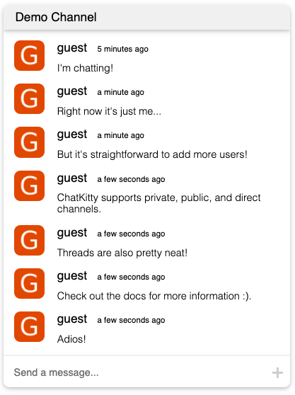

# chatkitty-react-component-library

[Storybook](https://chatkitty.github.io/chatkitty-react-component-library/?path=/story/introduction-about--page)

[Quick Start](https://chatkitty.github.io/chatkitty-react-component-library/?path=/story/introduction-quick-start--page)

## Introduction

ChatKitty's React component library is the fastest way to build chat. This library offers:

- Hooks that interact directly with ChatKitty's chat backend.
- Presentational chat components (channels, message lists, typing indicators).
- UI Customization through themes and CSS classes.

The library is designed with a few core principles in mind:

- **Fast time-to-value**. Components and hooks can be composed to build full-feature, full-stack chat solutions in record time.
- **Simple and extensible**. Components solve core use-cases and are easily extendable. Try building your own!
- **Readily customizable**. Themes and CSS classes can be readily configured and customized.
- **Strong typing**. We're bullish on typescript.

## ChatKitty Chat Features

- Public Chat
- Private Chat
- Group Chat
- Message Threads
- Push Notifications
- File Attachments
- Typing Indicators
- Reactions
- Presence Indicators
- Delivery and Read Receipts
- Link Preview Generation
- Chatbot Integration
- Chat Functions
- User Access Rules
- Auto Moderation
- Event Webhooks

\*_Note: although this library is still evolving towards feature parity, all features can be readily implemented using the [ChatKitty JS SDK](https://github.com/ChatKitty/chatkitty-js)._

\*_If you find that certain functionality is missing, feel free to **create an issue** or **contribute a PR!**_

## Requirements

- React v16.8+ and ReactDOM v16.8+
- [ChatKitty JS SDK](https://github.com/ChatKitty/chatkitty-js)

## Other Documentation

- [ChatKitty](https://www.chatkitty.com/)
